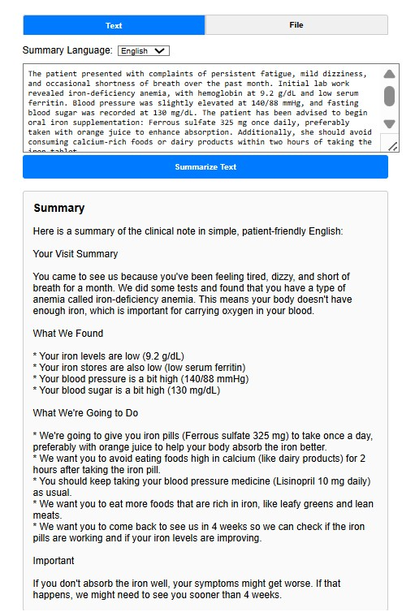
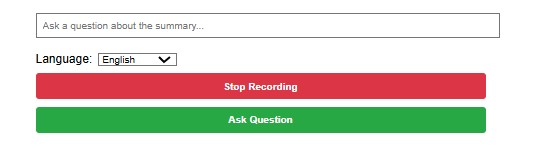
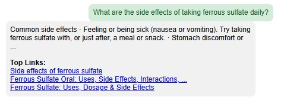
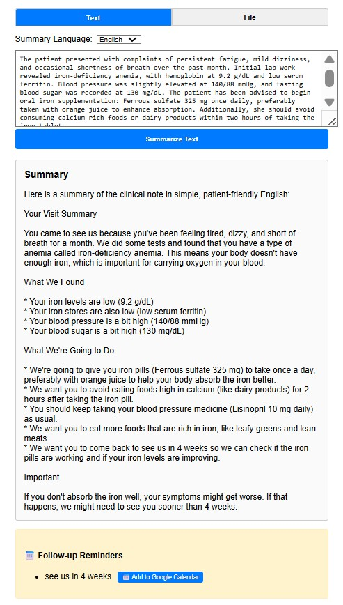
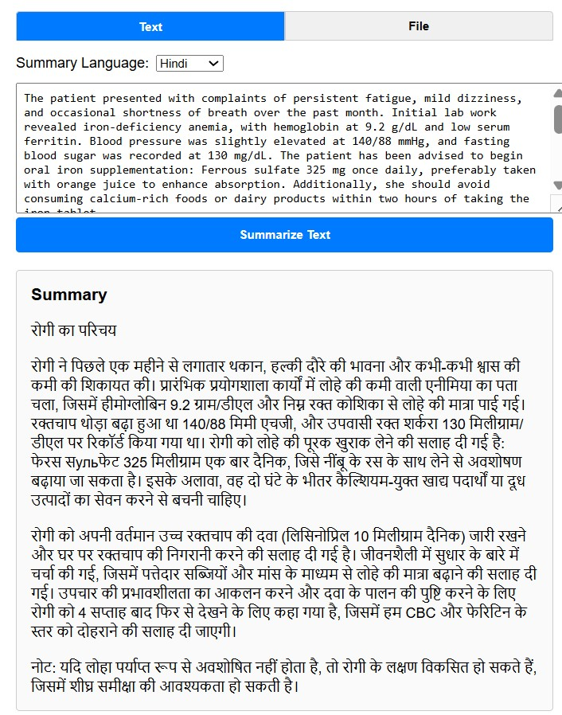

MediHelper

MediHelper is an AI-powered medical assistant designed to generate structured health summaries, enable voice-based transcription, perform intelligent web searches, and integrate with Google Calendar for follow-up scheduling. It leverages cutting-edge technologies like Snowflake LLM and SerpAPI for natural language tasks and medical data retrieval.

Features

1. Health Summary Generation
• Converts raw clinical text into concise and informative health summaries using Snowflake LLM.
• Summaries are suitable for EHR inputs or patient briefings.

2. Voice Input Transcription
• Transcribes spoken medical notes to structured text using Deepgram.
• Useful for hands-free operation in a clinical setting.

3. Intelligent Web Search
• Uses SerpAPI to perform real-time medical or drug-related queries.
• Retrieves up-to-date contextual information for patient care.

4. Google Calendar Integration
• Automatically creates follow-up events for appointments or tests.
• Simplifies medical workflow automation.

5. Language Support & Translation
• Allows users to translate medical summaries or instructions into the patient’s preferred language.
• Enhances accessibility for non-English-speaking users.
• Useful in multilingual healthcare environments.

🧰 Tech Stack
• Backend: FastAPI, Uvicorn
• Frontend: React.js (with Vite)
• AI Models: Snowflake Cortex LLM, SerpAPI
• Voice Processing: Deepgram API
• Scheduling: Google Calendar API
• Environment: Virtualenv (venv)

Setup Instructions
1. Clone the repository:
   git clone https://github.com/PriyankaWani66/medihelper.git

2. Navigate to the backend folder and set up the backend (FastAPI):
   cd medihelper/backend
   python -m venv .venv
   source .venv/bin/activate  (Use .venv\Scripts\activate on Windows)
   pip install -r requirements.txt

3. Set up the .env file with the following variables:
    # Snowflake Configuration
    SNOWFLAKE_USER=your_username
    SNOWFLAKE_PASSWORD=your_password
    SNOWFLAKE_ACCOUNT=your_account_identifier
    SNOWFLAKE_WAREHOUSE=your_warehouse
    SNOWFLAKE_DATABASE=your_database
    SNOWFLAKE_SCHEMA=your_schema
    # API Keys
    SERPAPI_API_KEY=your_serpapi_key
    DEEPGRAM_API_KEY=your_deepgram_key

4. Run the backend server:
   uvicorn app:app --reload

5. Set up the frontend (React + Vite)
   cd medihelper/frontend
   npm install
   npm run dev

📁 Project Structure
medihelper/
├── backend/
│   ├── app.py               # FastAPI backend logic
│   ├── summarizer.py        # Handles summarization using LLM
│   ├── extractor.py         # Extracts follow-up and structured data
│   ├── voice_api.py         # Handles Deepgram audio processing
│   ├── test_summary.py      # Unit tests for summary module
│   └── .env                 # Environment secrets

├── frontend/
│   ├── src/
│   │   ├── components/       # React components like SummaryForm, VoiceRecorder
│   │   └── utils/            # Calendar link and follow-up helpers
│   ├── package.json          # Frontend dependencies
│   └── vite.config.js        # Vite configuration

├── screenshots/              # UI screenshots for documentation
├── README.md                 # Markdown documentation

Future Improvements
Personalized Preventive Care Alerts
   Use patient history + AI to predict and nudge patients toward preventive checkups or screenings before problems escalate

